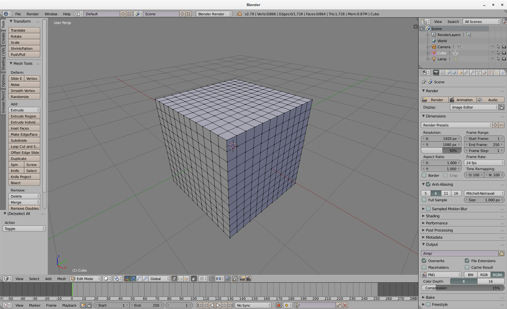
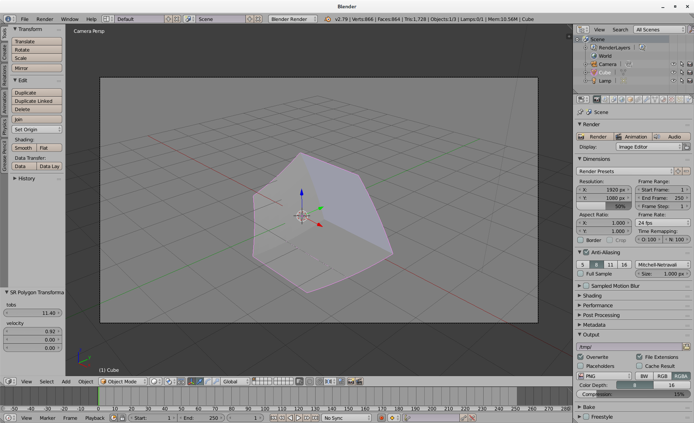
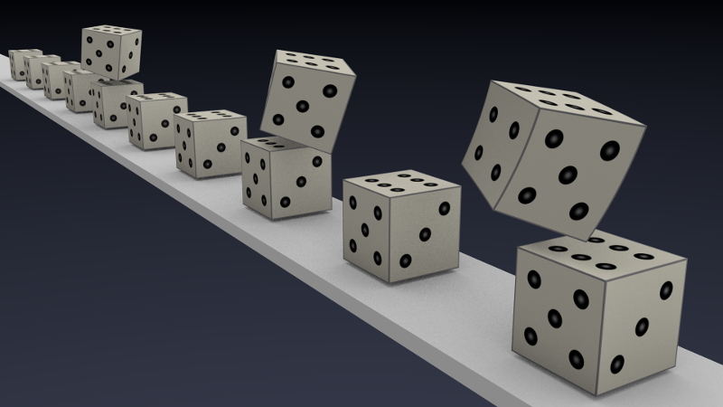

# Special-Relativistic Polygon Rendering with Blender

## Introduction
Special-Relativistic Polygon Rendering is a straightforward method to show what 
an observer moving with a velocity close to the speed of light would see.

The idea is as follows: Given a scene with a couple of objects where each object 
is at rest with respect to its local reference frame. Each reference frame, 
however, can move in an arbitrary direction with a different velocity. 
The observer has also its own reference frame which can move in an arbitrary 
direction. 
As each object shall be represented as a quad- or triangular mesh, the individual 
vertices of the mesh can be transformed according to the following algorithm. 
First, the current observer position is transformed into the local reference 
frame of an object by means of the Lorentz-Transformation between the two 
reference frames. Next, the backward lightcone of the observer is intersected
with the worldlines of all vertices in order to determine the events where light
has to be emitted to reach the observer at observation time. Finally, these
events are transformed into the reference frame of the observer. That's it.
Note that the finer meshed the surface is, the better is the approximation.

## Blender How-To
This is a very brief tutorial on how to use the blender add-on "SRPolygonTransform".

1. Start Blender and subdivide the mesh of the box:
    - Switch to Edit-Mode and press 'A' twice to deselect all.
    - Press Ctrl-R while hovering above an edge, move mouse wheel to insert 
      subdivision, and press left mouse button twice.
    - Repeat the above to subdivide all faces.
    - Switch back to Object-Mode.
    
        
   
2. Install Add-On:
    - File -> User Preferences -> Add-ons -> "Install Add-on from File..."
    - Select "srPolygonTransform.py" 
    - Object -> Select "SR Polygon Transformation"
   
3. Apply polygon transformation:
    - Press 'Space' and search for "SR..."
    - In the "Tool Shelf" (T), you can change the velocity in x-, y-, and z-
      direction. Note, however, that the magnitude of the velocity has to be
      below the speed of light.
    - Modify the observation time 'tobs' to see how the object moves.
    
      
   
4. The transformation is only valid for the camera. Thus, switch to the camera
   view to see the correct transformation.
   
5. When the transformation is applied to the mesh, you no longer can modify the
   velocity or the observation time. Thus, before you transform an object, you
   better make a copy of the original mesh and move it to a different layer.
   
A final image could look like this:

 

## References
* D. Weiskopf,  
  ["A Survey of Visualization Methods for Special Relativity"](http://drops.dagstuhl.de/opus/volltexte/2010/2711/pdf/20.pdf)
* T. Müller, S. Boblest,  
  ["Visual appearance of wireframe objects in special relativity"](https://doi.org/10.1088/0143-0807/35/6/065025)
* T. Müller, S. Grottel, D. Weiskopf,  
  ["Special Relativistic Visualization by Local Ray Tracing"](https://doi.org/10.1109/TVCG.2010.196)
* Kortemeyer et al,  
  ["A Slower Speed of Light"](http://gamelab.mit.edu/games/a-slower-speed-of-light/)  

## License
[CC BY-NC-SA 4.0](http://creativecommons.org/licenses/by-nc-sa/4.0/)
